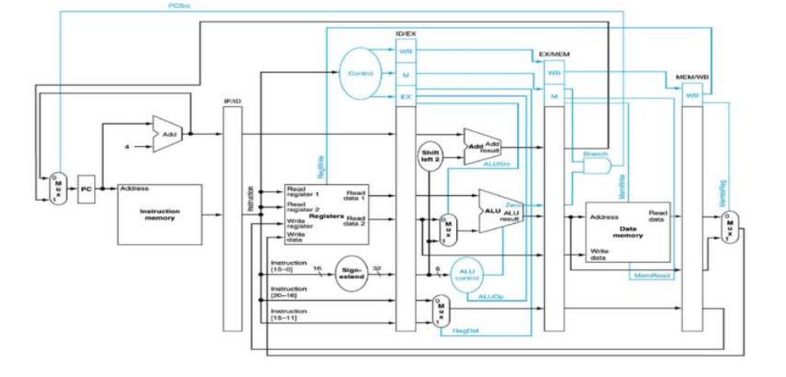

# MIPS-Single-Cycle-and-Pipeline

A comprehensive implementation of **MIPS processors** featuring both **single-cycle** and **5-stage pipelined architectures**, designed using **Verilog HDL** for educational and academic purposes.

## 📌 Overview

This repository contains two implementations of the **MIPS (Microprocessor without Interlocked Pipelined Stages)** architecture:

##  **Single-Cycle Processor**
  * Each instruction completes in one clock cycle
  * Simple and clear datapath
  * Ideal for understanding basic CPU design
 
  ## Single-Cycle MIPS Datapath

##  **Pipelined Processor**
  * Implements a classic **5-stage MIPS pipeline**
  * Includes hazard detection and forwarding
  * Demonstrates performance improvement over single-cycle design

## Pipelined MIPS Datapath

##  Features

### 🔹 Single-Cycle Processor
* Complete datapath implementation
* Unified control unit
* Supports:
  * R-type instructions
  * I-type instructions
  * J-type instructions
* Simple, readable, and educational design
* One instruction executed per clock cycle

### 🔹 Pipelined Processor
* Classic **5-stage pipeline**:
  * Instruction Fetch (IF)
  * Instruction Decode (ID)
  * Execute (EX)
  * Memory Access (MEM)
  * Write Back (WB)

* Hazard handling mechanisms:
  * *Data hazards* handled using forwarding
  * *Load-use hazards* handled using stall insertion
  * *Control hazards* handled via branch logic

* Pipeline registers:
  * IF/ID
  * ID/EX
  * EX/MEM
  * MEM/WB

* Higher throughput compared to single-cycle processor

---

## Supported Instructions

### R-Type Instructions
* add
* sub
* and
* or
* xor
* nor
* slt (set less than)
* sll (shift left logical)
* srl (shift right logical)
* sra (shift right arithmetic)
* jr (jump register)

---

### I-Type Instructions
* addi
* andi
* ori
* xori
* lw (load word)
* sw (store word)
* beq (branch if equal)
* bne (branch if not equal)
* slti (set less than immediate)
* lui (load upper immediate)

---

### J-Type Instructions
* j (jump)
* jal (jump and link)

---

## 🏗️ Architecture Components

### Core Modules
* **Program Counter (PC)**
  * Holds the address of the current instruction

* **Instruction Memory (IM)**
  * Stores program instructions

* **Register File**
  * 32 general-purpose registers
  * Supports two read ports and one write port

* **ALU (Arithmetic Logic Unit)**
  * Executes arithmetic and logical operations

* **Data Memory (DM)**
  * Used for load and store instructions

* **Main Control Unit**
  * Generates control signals for datapath components

---

### Pipeline-Specific Modules
* **Hazard Detection Unit**
  * Detects load-use and control hazards

* **Forwarding Unit**
  * Resolves data hazards by forwarding results

* **Pipeline Registers**
  * IF/ID
  * ID/EX
  * EX/MEM
  * MEM/WB

---

## 🎯 Project Goals
* Understand MIPS architecture fundamentals
* Compare single-cycle vs pipelined performance
* Learn datapath and control design using Verilog
* Practice hazard detection and resolution techniques

---

## 🛠️ Technology Used
* **Hardware Description Language:** Verilog HDL
* **Design Style:** Structural & Modular
* **Target Use:** Academic projects, learning CPU design

---
## Notes
* This project is intended for **educational use**
* Designs closely follow the classic **MIPS architecture**
* Easily extendable for additional instructions or features

---

## 👤 Author
**Ahmed Yasser**  
Computer Engineering Student  
MIPS | Verilog | Computer Architecture
